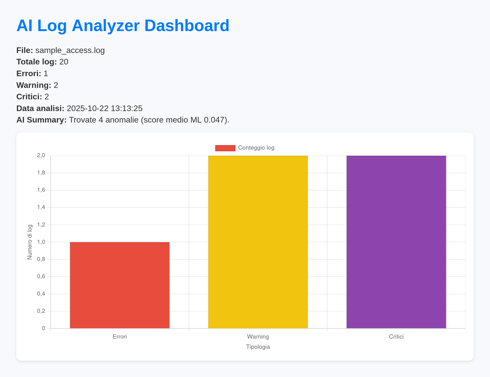

# AI-Log-Analyzer

**AI-Log-Analyzer** — un toolkit minimale ma professionale per l'analisi di log (Apache/nginx + syslog) che combina parsing, anomaly detection con Machine Learning e una dashboard web front-end.

> Architettura: **Java (static file server)** + **Python (analisi ML)** + **Vanilla JS (visualizzazione)**  
> - **Java:** serve la dashboard statica e l'API che restituisce il JSON dei risultati.  
> - **Python:** legge i log, esegue parsing, applica un modello di anomaly detection (Isolation Forest) e salva risultati in SQLite / JSON.  
> - **JS:** visualizza grafici (Chart.js) e riepiloghi AI.

---

##  Features principali

- Parsing di log HTTP e di sistema (formati comuni)
- Rilevamento anomalie non supervisionato con **Isolation Forest** (*scikit-learn*)
- Integrazione Java ↔ Python: API stabile e compatibile
- Dashboard vanilla JS + Chart.js per analisi visiva
- Esportazione automatica dei risultati in `data/results.db` e `analysis_result.json`

---

##  Isolation Forest

L’**Isolation Forest** è un algoritmo di *anomaly detection* non supervisionato basato sull’idea che le anomalie siano più semplici da isolare rispetto ai punti normali.

Durante l’analisi:
- Ogni log viene convertito in un vettore di feature numeriche (es. codice HTTP, dimensione, lunghezza URL, flag di errore)
- Il modello costruisce alberi binari casuali (*isolation trees*)
- I log che vengono isolati più rapidamente ottengono un punteggio elevato → **potenziali anomalie**

Questo approccio è:
- **Scalabile:** adatto a migliaia di log al secondo  
- **Indipendente dai dati etichettati:** funziona anche su log mai visti prima  
- **Affidabile:** genera uno *AI Summary* automatico con la valutazione di stabilità del sistema

---

##  Requisiti

- Python 3.10+ (consigliato 3.11+)
- Java 11+ (JDK)
- `pip` e `virtualenv`
- Connessione Internet per l’installazione delle dipendenze iniziali

### Setup rapido (Unix)
```bash
  python3 -m venv venv
  source venv/bin/activate
  pip install -r requirements.txt
  python3 analyzer/log_analyzer.py analyzer/sample_access.log
  javac server/Main.java
  java server.Main
  # Apri nel browser → http://localhost:8080
  ```
---

##  Dashboard Preview

Analisi in tempo reale dei log con conteggio errori, warning e criticità, più riepilogo AI con valutazione automatica.

<p align="center">
  
</p>

---
AI-Analyzer-Log/
##  Repository Structure

├── analyzer/
│ ├── log_analyzer.py # Script principale con ML
│ ├── sample_access.log # Esempio di log
│ └── data/
│ └── results.db # Database SQLite generato
│
├── server/
│ └── Main.java # Server HTTP statico
│
├── dashboard/
│ ├── index.html # Dashboard UI
│ ├── dashboard.js # Logica grafici
│ └── style.css # Stile minimale
│
├── requirements.txt
└── README.md

